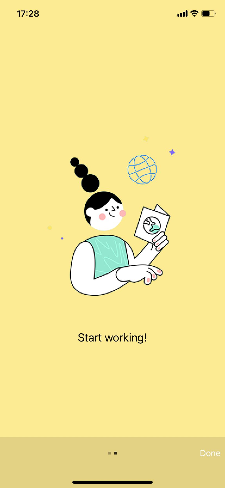
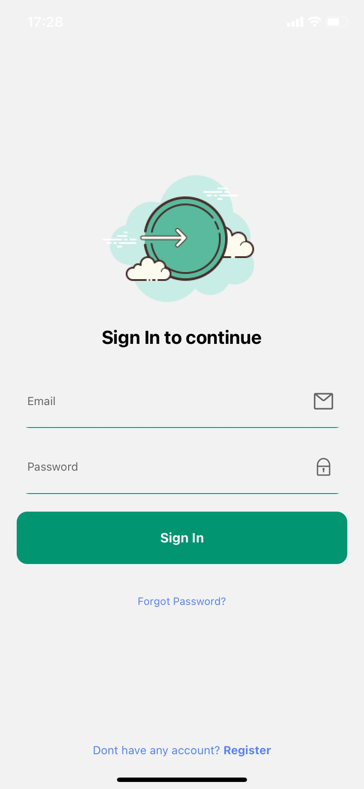
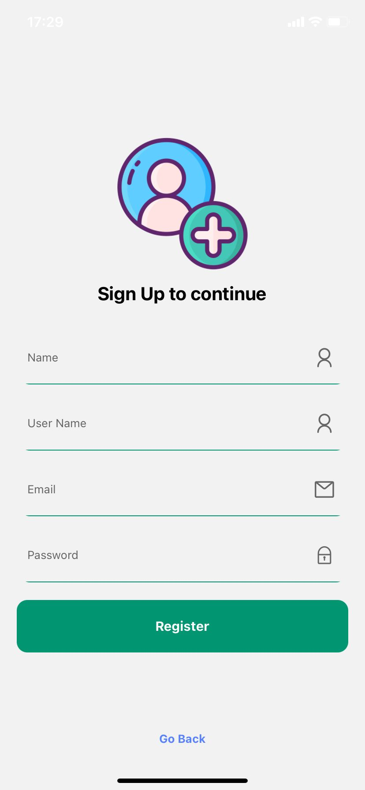
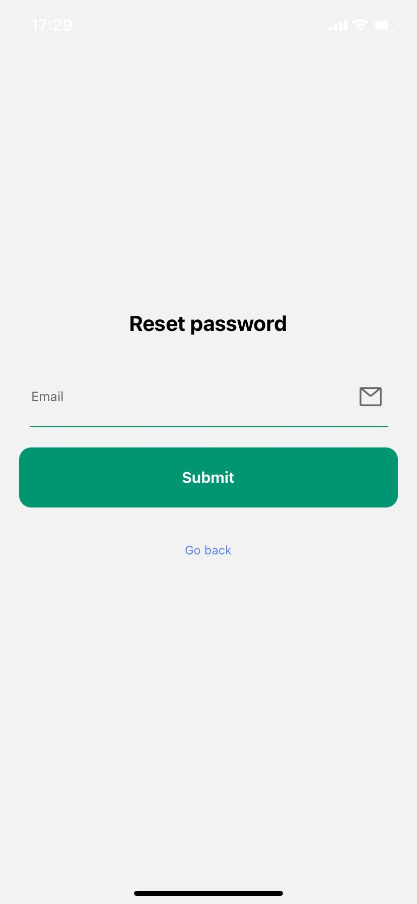
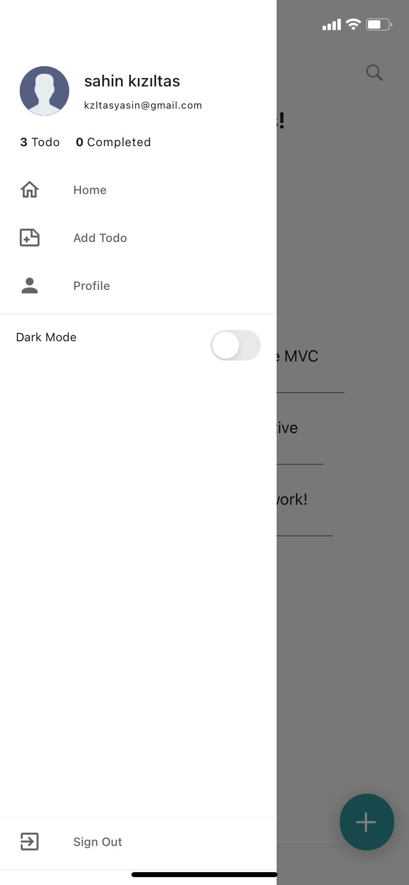
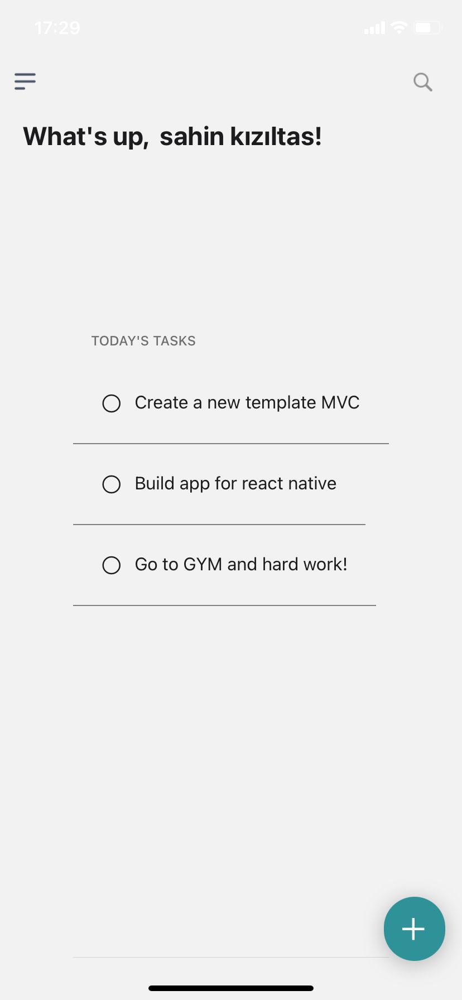
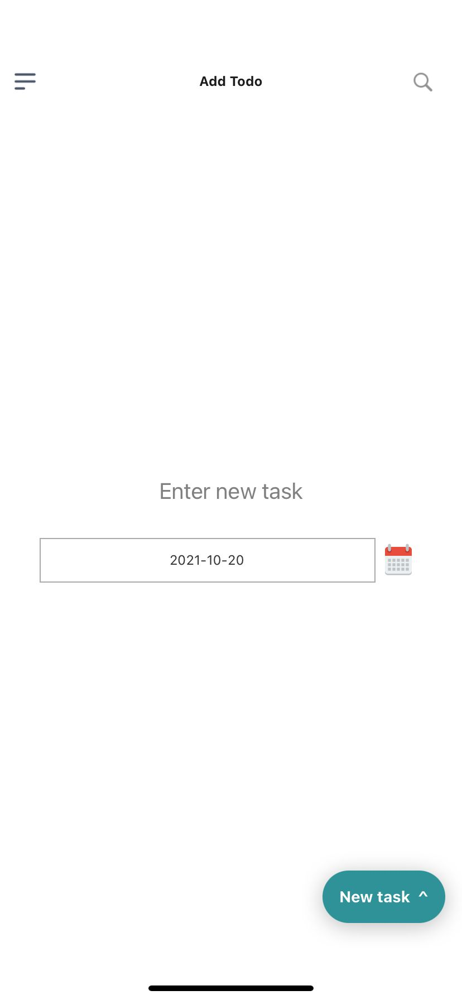
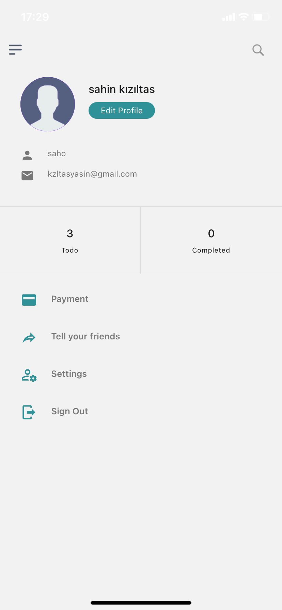

ToDo app for manage every works!

<b>Landing Page 1</b>

 
<b>Landing Page 2</b>

<b>Login Page</b>

 
 
<b>Register Page</b>

<b>Reset Password Page</b>

 <b>Drawer Page</b>

 
 <b>Main Page</b>

 
 <b>Add Todo Page</b>

 <b>Profile Page</b>

 <b>Edit Profile Page</b>

